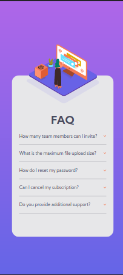

# Frontend Mentor - FAQ accordion card solution

This is a solution to the [FAQ accordion card challenge on Frontend Mentor](https://www.frontendmentor.io/challenges/faq-accordion-card-XlyjD0Oam). Frontend Mentor challenges help you improve your coding skills by building realistic projects. 

## Table of contents

- [Overview](#overview)
  - [The challenge](#the-challenge)
  - [Screenshot](#screenshot)
  - [Links](#links)
- [My process](#my-process)
  - [Built with](#built-with)
  - [What I learned](#what-i-learned)
  - [Continued development](#continued-development)
  - [Useful resources](#useful-resources)
- [Author](#author)
- [Acknowledgments](#acknowledgments)

## Overview

### The challenge

Users should be able to:

- View the optimal layout for the component depending on their device's screen size
- See hover states for all interactive elements on the page
- Hide/Show the answer to a question when the question is clicked

### Screenshot




### Links

- Solution URL: [Solution URL here](https://www.frontendmentor.io/solutions/faq-accordion-card-WMed-4QuQD)
- Live Site URL: [Add live site URL here](https://saurabh-gih.github.io/FAQ-Accordion-Card/)

## My process

### Built with

- Semantic HTML5 markup
- CSS custom properties
- Flexbox
- CSS Grid
- Javascript

### What I learned

The illustration image of women and box was tricky to put together. Initially I tried using positions and offset. But it was distorting and not responsive at all.

```html
<div class="image_container">
        <div class="image_wrapper_inner">
          <!--  -->
        </div>
        
      </div>
```

After searching various methods, finally I found that the women image had to be put in background of image_wrapper and background position had to be used. For image to take height of image_container, container's position is set to relative and image_wrapper's height to 100%. Positioning box was simple enough.

```css
.image_container{
    position: relative;
}
```
```css
.image_wrapper_inner{
    height: 100%;
    background: url(images/illustration-woman-online-desktop.svg);
    background-repeat: no-repeat;
    background-position: 120% center;
}
```

To avoid distortions I made its dimension in pixels.

The website is designed with grids. Initially I also tried with flexbox. But Grid proved to be more easier.

Javascript is pretty easy. Initially I tried using hidden attribute and toggling it to achieve the functionality. But DOMToken List's toggle is more easy and short.
```js
 if(question.parentNode.classList.contains("active")) {
            question.parentNode.classList.toggle("active")
        }
```

### Useful resources

- [Background Position](https://developer.mozilla.org/en-US/docs/Web/CSS/background-position) - Helped in understanding the syntax and value of Background position.
- [Understand CSS Positioning in crystal clear manner](https://alistapart.com/article/css-positioning-101/) - Helped me in understanding position property in crystal clear manner.

## Author

- Frontend Mentor - [@saurabhisdev](https://www.frontendmentor.io/profile/saurabhisdev)
- Twitter - [@saurabh_twt](https://twitter.com/saurabh__twt)
